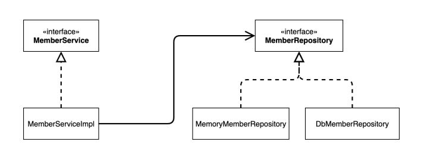
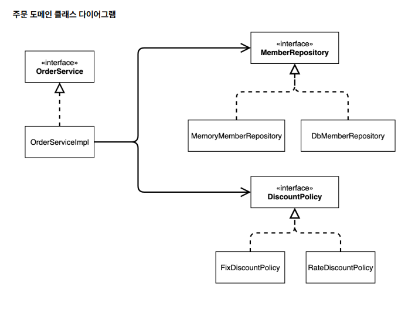

# 스프링 핵심원리 - 기본편
# 목차
- [섹션 1: 객체 지향 설계와 스프링](#섹션-1-객체-지향-설계와-스프링)
    - [좋은 객체 지향 프로그래밍이란?](#좋은-객체-지향-프로그래밍이란)
    - [좋은 객체 지향 설계의 5가지 원칙(SOLID)](#좋은-객체-지향-설계의-5가지-원칙solid)
    - [객체 지향 설계와 스프링](#객체-지향-설계와-스프링)
- [섹션 2: 스프링 핵심 원리 이해1 - 예제 만들기]
# 섹션 1: 객체 지향 설계와 스프링
## 좋은 객체 지향 프로그래밍이란?
- 객체 지향 프로그래밍
    - 컴퓨터 프로그램을 객체들의 모임으로 파악하는 것
    - 프로그램을 유연하고 변경에 용이하게 만듦
### 다형성
- 운전자의 역할이 있고, 자동차의 역할이 있음
    - 구현된 자동차가 바뀌어도 운전자에게 영향을 끼치지 않음
    - 운전자는 자동차의 역할(interface)에만 의존
- 역할과 구현으로 구분하면 세상이 단순해지고, 유연해지며, 변경도 편리해진다.
- 객체를 설계할 때 역할과 구현을 명확히 분리해야 함
    - 역할(인터페이스)를 먼저 부여하고, 그 역할을 수행하는 구현 객체 만들기
- 중요한 건 클라이언트와 서버간의 관계
    - 서버사이드에서 구현이 바뀌어도 클라이언트에 영향을 주지 않음
## 좋은 객체 지향 설계의 5가지 원칙(SOLID)
### SRP
- 단일 책임 원칙(Single Responsibility Principle)
- 한 클래스는 하나의 책임만 가져야 함
- 변경이 있을 때 파급 효과가 적으면 SRP를 잘 따른 것
### OCP
- 개방-폐쇄 원칙(Open/closed principle)
- 소프트웨어 요소는 확장에는 열려 있으나, 변경에는 닫혀 있어야 함
- 다형성을 활용
    - 역할과 구현의 분리
    - 클래스를 만들어 기능을 구현(확장에 열림)
    - 인터페이스를 수정하지 않음(
    변경에는 닫힘)
```java
public class MemberService {
    private MemberRepository memberRepository = new MemoryMemberRepository();

    private MemberRepository memberRepository = new JdbcMemberRepository();
}
```
- 문제점
    - MemberService 클라이언트가 구현 클래스를 직접 선택
    - 구현 클래스를 변경할려면 클라이언트 코드를 변경해야 함 -> OCP 원칙이 깨짐
### LSP
- 리스코프 치환 원칙(Liskov substitution principle)
- 프로그램의 객체는 프로그램의 정확성을 깨뜨리지 않으면서 하위 타입의 인스턴스로 바꿀 수 있어야 함
- 하위 클래스는 인터페이스의 규약을 지켜야 함
### ISP
- 인터페이스 분리 원칙(Interface segregation principle)
- 특정 클라이언트를 위한 인터페이스 여러 개가 범용 인터페이스 하나보다 나음
### DIP
- 의존관계 역전 원칙(Dependency inversion principle)
- 프로그래머는 추상화에 의존해야지, 구체화에 의존하면 안됨
- 구현 클래스가 아닌 인터페이스에 의존해야 함
- 위의 코드는 구현 클래스를 의존하고 있음
## 객체 지향 설계와 스프링
- 스프링은 다형성 + OCP, DIP를 가능하게 지원
    - DI(Dependency Injection) : 의존관계, 의존성 주입
    - DI 컨테이너 제공 : 자바 객체들을 컨테이너에 넣어 의존관계를 관리함
- 클라이언트 코드의 변경 없이 기능 확장
- 순수 자바로 OCP, DIP 원칙을 지키면서 개발을 하면 결국 스프링 프레임워크(정확히는 DI 컨테이너)를 만들게 됨
# 섹션 2: 스프링 핵심 원리 이해1 - 예제 만들기
## 비즈니스 요구사항과 설계
- 회원
    - 회원가입 및 조회
    - 두 가지 등급
    - 회원 db는 아직 미확정
- 주문과 할인 정책
    - 회원은 상품 주문 가능
    - 등급에 따른 할인 정책
    - 정책 변경 가능성이 높음
## 회원 도메인 설계

## 회원 도메인 개발
## 회원 도메인 실행과 테스트
- 테스트(Given-When-Then 패턴)
    - `@Test`
        - JUnit 프레임워크
        - 테스트 메서드임을 알리는 어노테이션
    - Given(준비) - When(실행) - Then(검증)
## 주문과 할인 도메인 설계
