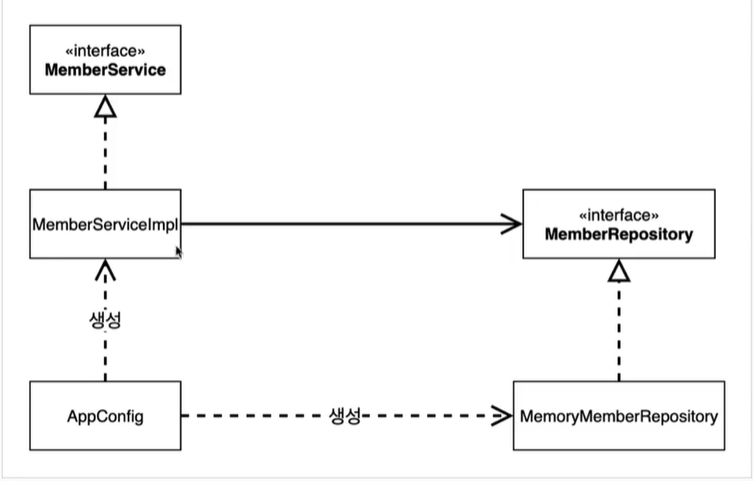

# 스프링 핵심원리 - 기본편
# 목차
- [섹션 1: 객체 지향 설계와 스프링](#섹션-1-객체-지향-설계와-스프링)
    - [좋은 객체 지향 프로그래밍이란?](#좋은-객체-지향-프로그래밍이란)
    - [좋은 객체 지향 설계의 5가지 원칙(SOLID)](#좋은-객체-지향-설계의-5가지-원칙solid)
    - [객체 지향 설계와 스프링](#객체-지향-설계와-스프링)
- [섹션 2: 스프링 핵심 원리 이해1 - 예제 만들기](#섹션-2-스프링-핵심-원리-이해1---예제-만들기)
    - [비즈니스 요구사항과 설계](#비즈니스-요구사항과-설계)
    - [회원 도메인 설계](#회원-도메인-설계)
    - [회원 도메인 개발](#회원-도메인-개발)
    - [회원 도메인 실행과 테스트](#회원-도메인-실행과-테스트)
    - [주문과 할인 도메인 설계](#주문과-할인-도메인-설계)
    - [주문과 할인 도메인 개발](#주문과-할인-도메인-개발)
    - [주문과 할인 도메인 실행과 테스트](#주문과-할인-도메인-실행과-테스트)
- [섹션 3: 스프링 핵심 원리 이해2 - 객체 지향 원리 적용](#섹션-3-스프링-핵심-원리-이해2---객체-지향-원리-적용)
    - [새로운 할인 정책 개발](#새로운-할인-정책-개발)
    - [새로운 할인 정책 적용과 문제점](#새로운-할인-정책-적용과-문제점)
    - [관심사의 분리](#관심사의-분리)
    - [AppConfig 리팩터링]
    - [새로운 구조와 할인 정책 적용]
    - [전체 흐름 정리]
    - [좋은 객체 지향 설계의 5가지 원칙의 적용]
    - [IoC, DI, 그리고 컨테이너]
    - [스프링으로 전환하기]
# 섹션 1: 객체 지향 설계와 스프링
## 좋은 객체 지향 프로그래밍이란?
- 객체 지향 프로그래밍
    - 컴퓨터 프로그램을 객체들의 모임으로 파악하는 것
    - 프로그램을 유연하고 변경에 용이하게 만듦
### 다형성
- 운전자의 역할이 있고, 자동차의 역할이 있음
    - 구현된 자동차가 바뀌어도 운전자에게 영향을 끼치지 않음
    - 운전자는 자동차의 역할(interface)에만 의존
- 역할과 구현으로 구분하면 세상이 단순해지고, 유연해지며, 변경도 편리해진다.
- 객체를 설계할 때 역할과 구현을 명확히 분리해야 함
    - 역할(인터페이스)를 먼저 부여하고, 그 역할을 수행하는 구현 객체 만들기
- 중요한 건 클라이언트와 서버간의 관계
    - 서버사이드에서 구현이 바뀌어도 클라이언트에 영향을 주지 않음
## 좋은 객체 지향 설계의 5가지 원칙(SOLID)
### SRP
- 단일 책임 원칙(Single Responsibility Principle)
- 한 클래스는 하나의 책임만 가져야 함
- 변경이 있을 때 파급 효과가 적으면 SRP를 잘 따른 것
### OCP
- 개방-폐쇄 원칙(Open/closed principle)
- 소프트웨어 요소는 확장에는 열려 있으나, 변경에는 닫혀 있어야 함
- 다형성을 활용
    - 역할과 구현의 분리
    - 클래스를 만들어 기능을 구현(확장에 열림)
    - 인터페이스를 수정하지 않음(
    변경에는 닫힘)
```java
public class MemberService {
    private MemberRepository memberRepository = new MemoryMemberRepository();

    private MemberRepository memberRepository = new JdbcMemberRepository();
}
```
- 문제점
    - MemberService 클라이언트가 구현 클래스를 직접 선택
    - 구현 클래스를 변경할려면 클라이언트 코드를 변경해야 함 -> OCP 원칙이 깨짐
### LSP
- 리스코프 치환 원칙(Liskov substitution principle)
- 프로그램의 객체는 프로그램의 정확성을 깨뜨리지 않으면서 하위 타입의 인스턴스로 바꿀 수 있어야 함
- 하위 클래스는 인터페이스의 규약을 지켜야 함
### ISP
- 인터페이스 분리 원칙(Interface segregation principle)
- 특정 클라이언트를 위한 인터페이스 여러 개가 범용 인터페이스 하나보다 나음
### DIP
- 의존관계 역전 원칙(Dependency inversion principle)
- 프로그래머는 추상화에 의존해야지, 구체화에 의존하면 안됨
- 구현 클래스가 아닌 인터페이스에 의존해야 함
- 위의 코드는 구현 클래스를 의존하고 있음
## 객체 지향 설계와 스프링
- 스프링은 다형성 + OCP, DIP를 가능하게 지원
    - DI(Dependency Injection) : 의존관계, 의존성 주입
    - DI 컨테이너 제공 : 자바 객체들을 컨테이너에 넣어 의존관계를 관리함
- 클라이언트 코드의 변경 없이 기능 확장
- 순수 자바로 OCP, DIP 원칙을 지키면서 개발을 하면 결국 스프링 프레임워크(정확히는 DI 컨테이너)를 만들게 됨
# 섹션 2: 스프링 핵심 원리 이해1 - 예제 만들기
## 비즈니스 요구사항과 설계
- 회원
    - 회원가입 및 조회
    - 두 가지 등급
    - 회원 db는 아직 미확정
- 주문과 할인 정책
    - 회원은 상품 주문 가능
    - 등급에 따른 할인 정책
    - 정책 변경 가능성이 높음
## 회원 도메인 설계

## 회원 도메인 개발
```java
public class MemberServiceImpl implements MemberService{

    private final MemberRepository memberRepository = new MemoryMemberRepository();

    @Override
    public void join(Member member) {
        memberRepository.save(member);
    }

    @Override
    public Member findMember(Long memberId) {
        return memberRepository.findById(memberId);
    }
    
}

```
## 회원 도메인 실행과 테스트
- 테스트(Given-When-Then 패턴)
    - `@Test`
        - JUnit 프레임워크
        - 테스트 메서드임을 알리는 어노테이션
    - Given(준비) - When(실행) - Then(검증)
```java
@Test
void join() {

    MemberService memberService = new MemberServiceImpl();

    //given
    Member member = new Member(1L, "memberA", Grade.VIP);

    //when
    memberService.join(member);
    Member findMember = memberService.findMember(1L);

    //then
    Assertions.assertThat(member).isEqualTo(findMember);        
}
```
## 주문과 할인 도메인 설계

## 주문과 할인 도메인 개발
```java
public class OrderServiceImpl implements OrderService{

    private final MemberRepository memberRepository = new MemoryMemberRepository();
    private final DiscountPolicy discountPolicy = new FixDiscountPolicy();

    @Override
    public Order creatOrder(Long memberId, String itemName, int itemPrice) {
        Member member = memberRepository.findById(memberId);
        int discountPrice = discountPolicy.discount(member, itemPrice);

        return new Order(memberId, itemName, itemPrice, discountPrice);
    }
    
}
```
## 주문과 할인 도메인 실행과 테스트
- 단위 테스트
    - 순수 자바 코드로 하는 테스트
```java
@Test
void creatOrder() {
    //given
    Long memberId = 1L;
    Member member = new Member(memberId, "memberA", Grade.VIP);

    //when
    memberService.join(member);
    Order order = orderService.creatOrder(memberId, "iteamA", 10000);

    //then
    Assertions.assertThat(order.getDiscountPrice()).isEqualTo(1000);
    }
```
# 섹션 3: 스프링 핵심 원리 이해2 - 객체 지향 원리 적용
## 새로운 할인 정책 개발
- 기존의 고정 금액 할인 정책에서 정률 할인 정책으로 변경하려 함
```java
public class RateDiscountPolicy implements DiscountPolicy {

    private int discountPercent = 10;

    @Override
    public int discount(Member member, int price) {
        if (member.getGrade() == Grade.VIP) {
            return price * discountPercent / 100;
        } else {
            return 0;
        }
    }
}
```
## 새로운 할인 정책 적용과 문제점
- 정률 할인 정책을 적용하기 위해서는 `OrderServiceImpl`의 코드를 변경해야 함
```java
public class OrderServiceImpl implements OrderService {
    // private final DiscountPolicy discountPolicy = new FixDiscountPolicy();
    private final DiscountPolicy discountPolicy = new RateDiscountPolicy();
```
- OCP와 DIP 같은 객체지향 설계 원칙을 준수하지 못하는 것
    - 추상(인터페이스)인 `DiscountPoliy` 뿐 만 아니라, 구체(구현) 클래스인 `FixDiscountPolicy`, `RateDiscountPolicy`에도 의존하고 있음 -> DIP 위반
    - 할인 정책을 바꾸기 위해서 `OrderServiceImpl`의 코드를 직접 바꿔야 함 -> OCP 위반
- 인터페이스에만 의존하도록 의존관계를 변경한다면? -> 할당된게 없기 때문에 `NullPointException`!!!!
```java
public class OrderServiceImpl implements OrderService {
    private final DiscountPolicy discountPolicy;
```
- 이를 해결하기 위해서는 누군가 `OrderServiceImpl`에 `DiscountPolicy`의 구현 객체를 생성하고 대신 주입해야 함
## 관심사의 분리
- 애플리케이션이 하나의 공연이라 봤을 때, 위의 코드는 한 역할을 맡은 배우가 다른 역할을 맡을 배우를 직접 정하는 것과 같음 -> 배우가 다양한 책임을 가지고 있음
- 배우가 본인의 역할에 충실히 할 수 있게 하기 위해, 역할에 맞는 배우를 지정하는 역할을 가진 `공연 기획자`가 필요함
### AppConfig의 등장
- 구현 객체를 생성하고 연결하는 책임을 가진 별도의 설정 클래스
```java
// AppConfig
public class AppConfig {
    
    public MemberService memberService() {
        return new MemberServiceImpl(new MemoryMemberRepository());
    }

    public OrderService orderService() {
        return new OrderServiceImpl(new MemoryMemberRepository(), new FixDiscountPolicy());
    }
}

// MemberServiceImpl
public class MemberServiceImpl implements MemberService {

    private final MemberRepository memberRepository;

    public MemberServiceImpl(MemberRepository memberRepository) {
        this.memberRepository = memberRepository;
    }

// OrderServiceImpl
public class OrderServiceImpl implements OrderService {

    private final MemberRepository memberRepository;
    private final DiscountPolicy discountPolicy;

    public OrderServiceImpl(MemberRepository memberRepository, DiscountPolicy discountPolicy) {
        this.memberRepository = memberRepository;
        this.discountPolicy = discountPolicy;
    }

```
- 애플리케이션의 실제 동작에 필요한 구현 객체를 생성함
- 생성한 객체 인스턴스의 참조를 생성자를 통해서 주입 해준다 -> 생성자 주입

- 객체의 생성과 연결을 `AppConfing`가 담당
- 의존성 주입(DI) : 의존관계를 외부에서 주입하는 것
    - ex) `appconfing`가 `MemoryMemberRepository` 객체를 생성하고, 그 참조값을 `MemberServiceImpl`에 전달함
### AppConfig 실행
```java
public class OrderApp {
    public static void main(String[] args) {
        AppConfig appConfig = new AppConfig();
        MemberService memberService = appConfig.memberService();
        OrderService orderService = appConfig.orderService();

```
```java
public class OrderServiceTest {

    MemberService memberService;
    OrderService orderService;

    @BeforeEach
    public void beforeEach() {
        AppConfig appconfig = new AppConfig();
        memberService = appconfig.memberService();
        orderService = appconfig.orderService();
    }
```
- @BeforeEach : 각 테스트가 실행되기 전에 호출함
## AppConfig 리팩터링
```java
public class AppConfig {
    
    public MemberService memberService() {
        // return new MemberServiceImpl(new MemoryMemberRepository());
        return new MemberServiceImpl(memberRepository());
    }

    public MemberRepository memberRepository() {
        return new MemoryMemberRepository();
    }

    public OrderService orderService() {
        // return new OrderServiceImpl(new MemoryMemberRepository(), new FixDiscountPolicy());
        return new OrderServiceImpl(memberRepository(), discountPolicy());
    }

    public DiscountPolicy discountPolicy() {
        return new FixDiscountPolicy();
    }
}
```
- 기존의 `AppConfig`는 중복이 있고, 역할에 따른 구현을 쉽게 찾을 수 없었음
    - `MemoryMemberRepository()`가 중복
    - `new MemoryMemberRepository()`를 봤을 때 어떤 역할을 가지는지 빠르게 파악 어려움
- 역할과 구현을 한 눈에 들어오게 하여, 애플리케이션의 전체 구성을 빠르게 파악할 수 있음
## 새로운 구조와 할인 정책 적용
- `AppConfig`로 인해 애플리케이션이 사용 영역과 구성 영역으로 분리 되었음
- 할인 정책을 바꾸기 위해 사용 영역을 변경할 필요 없이, 구성 영역의 `AppConfig`만 수정하면 됨
- 
